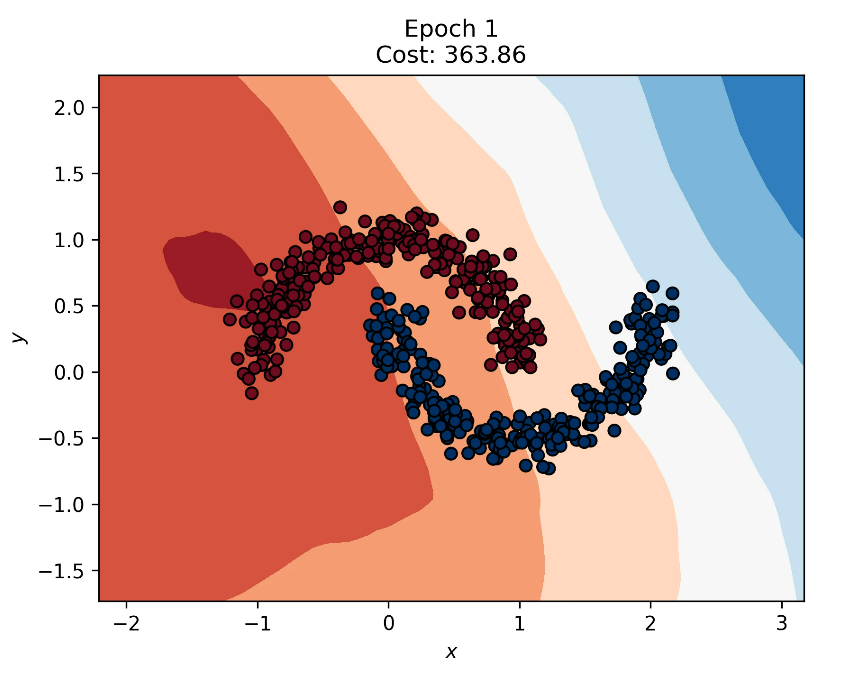
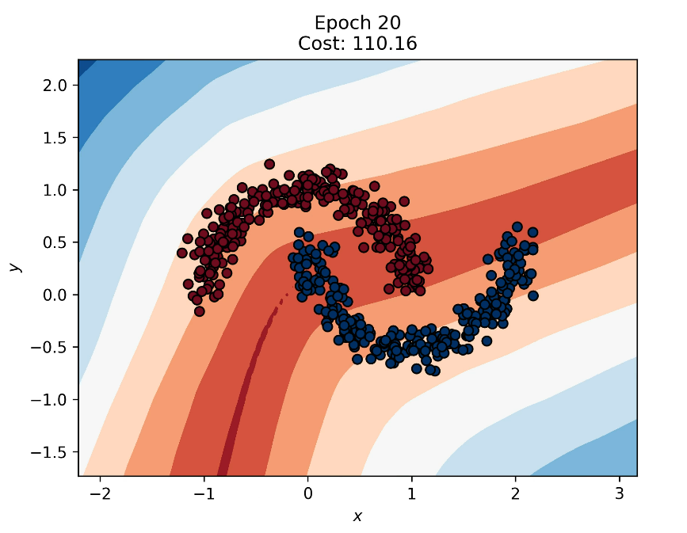
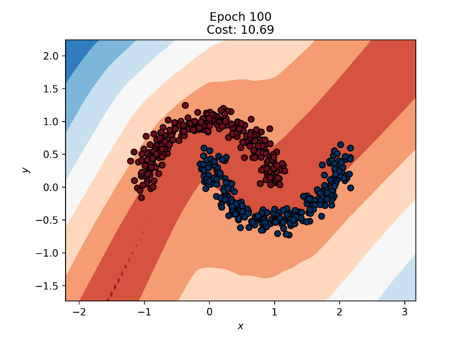
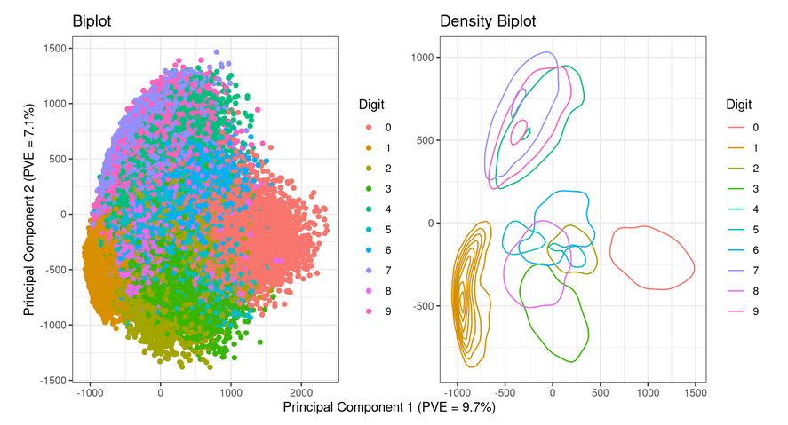
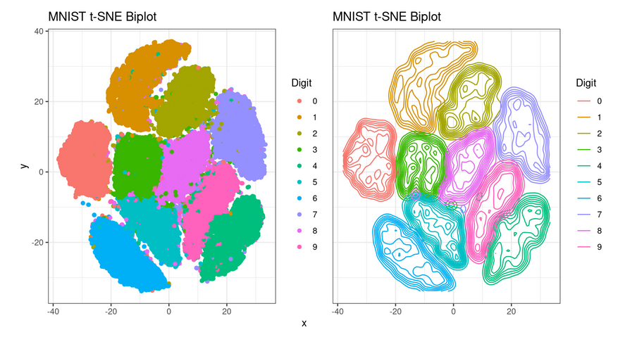
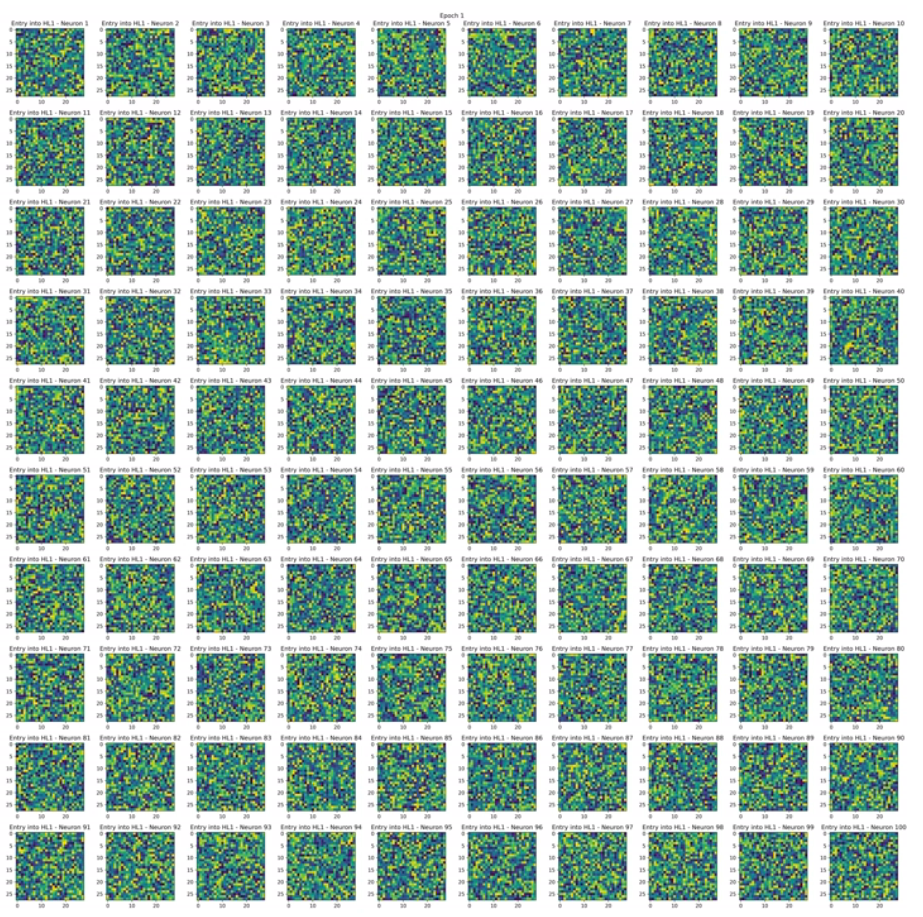
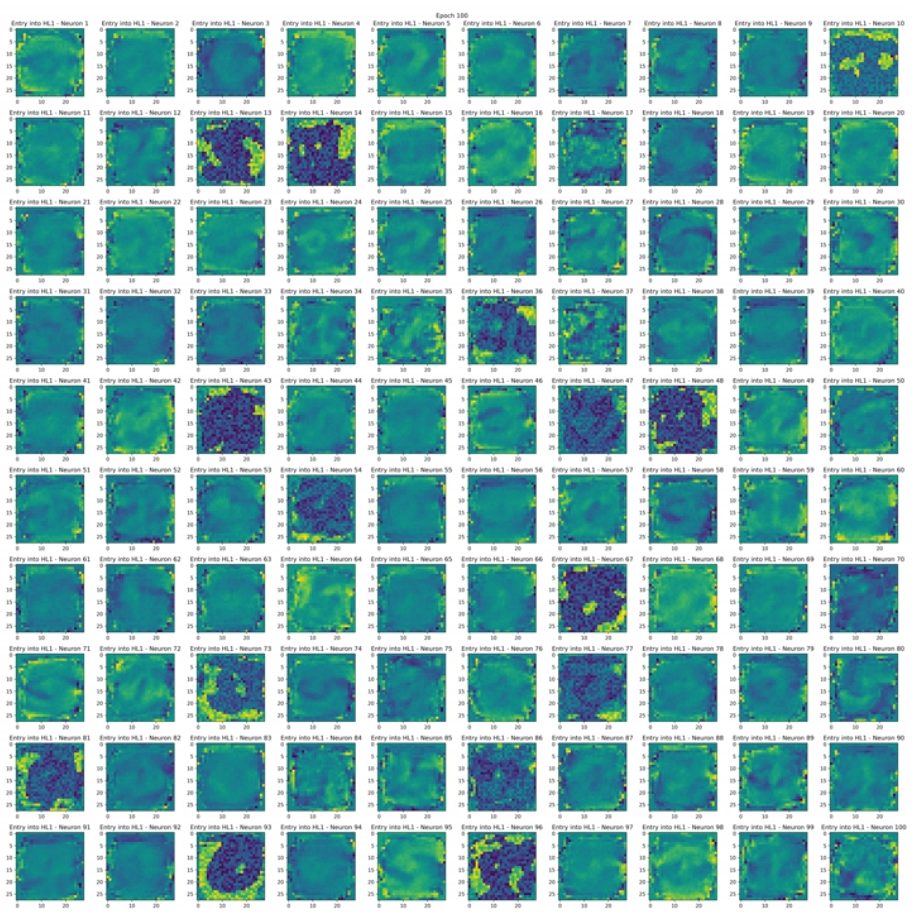

## Introduction

Recently, I just finished a semester-long project in which a colleague and I investigated how neural networks learn using visualizations. As a computer and data scientist, this topic has fascinated me for a while. We spend so much time constructing and refining neural networks, but very little time actually trying to understand how they work behind the scenes.

## Background

Neural networks are inherently black-box models, meaning data goes in one side, and results come out the other. This is unfortunate, as it means that neither the developer nor the end user has any idea what is actually taking place within the network. This results in outputs that are often uninterpretable and can call into question whether or not the results are even trustworthy.

This is a major problem, and it is only getting worse as we grow increasingly reliant on AI models in every aspect of our lives. It grows even worse when we take into account the fact that our models are becoming bigger and more complex, with the latest fascination being large language models (LLMs).

Unfortunately, there is no simple solution to this issue, and even beginning to look into the learning process within a network requires an engaged effort from the creator. Our project began an investigation into methods through which neural networks could be visualized, with the goal of adding transparency to the model training process and turning AI into XAI (Explainable AI).

### Project Scope

As this was a semester project, the scope had to be fairly limited. Most notably, we did not set out to try and set up a modular application in which any network could be visualized and instead focused on a few chosen datasets (to establish a prototype of sorts).

We also only looked at classification networks, as regression networks are another animal entirely and would likely suffer from even more extreme interpretability issues than classifiers

## Design Objectives and Decisions

Our approach to visualizing the learning process consisted of visualizing network weights (for image classification tasks) through the use of animated image plots. To create these plots, we plotted each weight in a layer as a single pixel in the image, with the color representing the value of that weight. Each image is made up of all the weights for a single neuron in a layer, and the images were arranged in a grid with all the images for that layer. To show how these weights evolve over the course of network training, we stitched the grid plots together into an animation.

The other main component of our visualization of the learning process was visualizing network decision boundaries over time. To do this, we created a scatterplot of the data points and overlaid it on top of a contour plot representing the decision boundary of the network. In the scatterplot, the color of a point represents the class it is a part of. The colors of the contours are a bit harder to interpret (an area for improvement), but the dark red regions represent the actual decision boundary, and the network becomes more uncertain (represented as the color getting lighter, then changing to blue) as it gets farther away from the dark red region. Again, we wanted to show how the decision boundary changes during the training process, so we stitched the contour plots together into an animation.

### Tools Used

To train our network and store the weights, we used Python with the PyTorch and SciKit-Learn libraries.
The weight and boundary visualizations were created in Python and animated using ffmpeg.
The exploratory PCA and *t*-SNE plots were created with R and ggplot, with the 3-dimensional plots being made with ggplotly.
The overarching website was created using R-markdown, knit (compiled) to a couple of html pages, and then hosted using GitHub pages.

## Results

The website for this project can be found at [https://ptdewey.com/neural-net-viz](https://ptdewey.com/neural-net-viz) [^1].

### Visualizing Decision Boundaries

The decision boundary contour plot animations demonstrate how a neural network's decision boundary evolves and bisects the dataset it is trained on. Points represent the dataset, and the contoured background shows the decision boundary, with colors indicating the distance from the boundary. For example, using the Moons dataset, a highly nonlinear boundary is needed for correct classification.

* Decision Boundary: Epoch 1

The initial state of the decision boundary is completely random at the start of training.

* Decision Boundary: Epoch 20

After 20 epochs, the boundary has shaped to separate many of the points from each cluster, but it still misclassifies many entries at this point.

* Decision Boundary: Epoch 100

After 100 epochs, we can see that the decision boundary perfectly separates the two classes.

### Dimensionality Reduction for High-Dimensional Datasets

The exploratory analysis page includes plots using Principal Component Analysis (PCA) and *t*-Distributed Stochastic Neighbor Embedding (*t*-SNE) to illustrate class distributions in the MNIST dataset. PCA plots show blurred boundaries between classes, while *t*-SNE plots reveal distinct clusters and greater sensitivity to in-group differences. For both PCA and *t*-SNE we included a biplot, de
nsity biplot, and 3D plot of the class embeddings.

* PCA Biplot and Density Biplot

* *t*-SNE Biplot and Density Biplot

Between the two dimensionality reduction algorithms, *t*-SNE was better in this case at visually separating the classes from the dataset. We found the density biplot to be the most effective at visually communicating the distribution of the different data classes.

### Visualizing Neuron Weights

Weight visualization animations show how neuron weights evolve during training for high-dimensional datasets like MNIST. Initially random, many of these weights gradually form (somewhat) recognizable patterns.

* Neuron Weights: Epoch 1

* Neuron Weights: Epoch 20

After 20 epochs, we can see a number of patterns that resemble entire numbers or parts of them.

* Neuron Weights: Epoch 100

After 100 epochs, most weights became very muddled, still holding the previous patterns but in more muddy state. This may seem counterintuitive as the network appears (from the eyes of a human) to have lost the original patterns, but the network was performing noticeably better in classification tasks at the 100 epoch mark.

## Limitations

A significant challenge in this project was visualizing high-dimensional data, decision boundaries, and weights. For instance, it wasn't possible to plot the decision boundary for the MNIST image classification dataset in a contour plot due to its high dimensionality. However, by using weight visualizations, it was possible to represent individual components of the decision boundary, offering insights into the network's behavior when trained on this dataset.
To address the dimensionality issue, PCA could be used to shrink the decision boundary into two or three dimensions, making visualization possible through contour plots. While this approach might produce messy or unclear results, it warrants further exploration and could yield intriguing findings.

Another inherent limitation is that for large datasets with many unique output classes, weight visualizations often become unintelligible due to the wide range of possible weight values. This issue is more complex than the dimensionality problem but represents another potential area for future research.

## Closing Thoughts

This project underscored the complexity of visualizing neural networks, especially when dealing with high-dimensional data. Despite the challenges, our efforts provided valuable insights into the learning processes of neural networks. By visualizing decision boundaries and neuron weights, we were able to peek into the black-box nature of these models and understand their behavior better.

The techniques we used, like PCA and *t*-SNE for dimensionality reduction, and animated weight visualizations, showed promise in making neural networks more interpretable. However, there are still significant limitations, especially in visualizing high-dimensional decision boundaries and weights for large datasets with many classes.

Future research could explore more advanced dimensionality reduction techniques or develop new methods for visualizing neural networks. Our project is a step towards making AI models more transparent and trustworthy, contributing to the broader goal of Explainable AI (XAI). By continuing to innovate and experiment, we can hope to further demystify these powerful yet complex models.

## Links

- [^1]: [Project Site](https://pdewey.com/neural-net-viz/)
- [^2]: [Source Code](https://github.com/ptdewey/neural-net-viz/)

